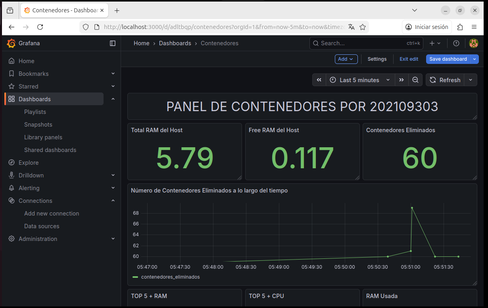
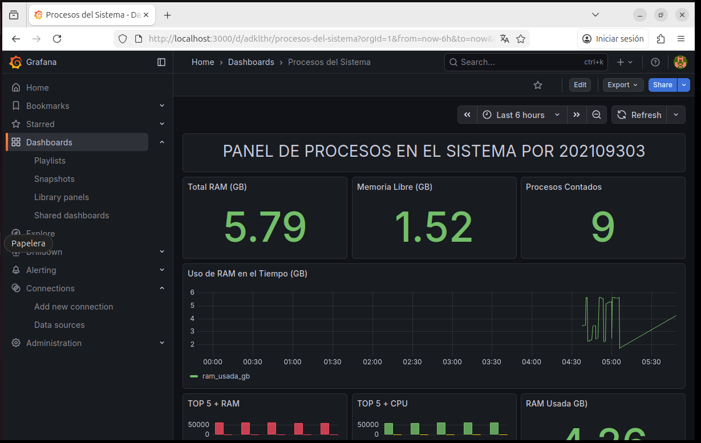

# Manual de Usuario – Proyecto 1

## 1. Introducción
Sistema para monitorear procesos y contenedores en Linux, eliminando automáticamente los que consumen demasiados recursos y mostrando métricas en Grafana.

---

## 2. Requisitos del sistema
- Linux con soporte para módulos de kernel.
- Docker y Docker Compose instalados.
- Go instalado (si se compila manualmente).
- Permisos de administrador (`sudo`).

---

## 3. Instalación y configuración

### 3.1 Clonar el repositorio
```bash
git clone <link-del-repo>
cd proyecto-1
```

### 3.2 Compilar y cargar los módulos de kernel
```bash
cd modulo-kernel
make
sudo insmod continfo.ko
sudo insmod sysinfo.ko
```

### 3.3 Levantar los servicios con Docker Compose
```bash
cd dashboard
docker compose up -d --build
```
El daemon en Go iniciará y comenzará a leer los archivos en /proc.

## 4. Diagramas y Arquitectura

### Flujo del sistema

```
Kernel → /proc → Daemon Go → SQLite → Grafana
```
Explicación
- El kernel expone datos en /proc.

- El daemon en Go los analiza y guarda en SQLite.

- Grafana muestra las métricas en gráficas interactivas.

## 5. Acceso al Dashboard de Grafana

1. Abrir navegador en:

```
http://localhost:3000
```

2. Usuario/contraseña por defecto:

```
admin / admin
```

3. Paneles disponibles:

    - Contenedores: RAM total, RAM libre, contenedores eliminados, Top 5 RAM, Top 5 CPU.

    - Procesos del sistema: RAM total, RAM libre, procesos contados, Top 5 RAM, Top 5 CPU.

## 6. Ejemplos de uso práctico

- Ver qué contenedor consume más RAM en el panel Top 5 + RAM.

- Observar cómo el sistema elimina automáticamente contenedores de alto consumo en el panel Contenedores eliminados a lo largo del tiempo.

- Validar que siempre existen 3 contenedores de bajo consumo y 2 de alto consumo.

## 7. Finalización del servicio

- Para detener el sistema:

- El daemon eliminará el cronjob automáticamente.

## 8. Grafana


